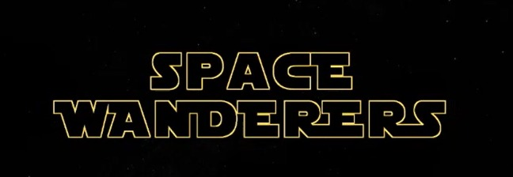
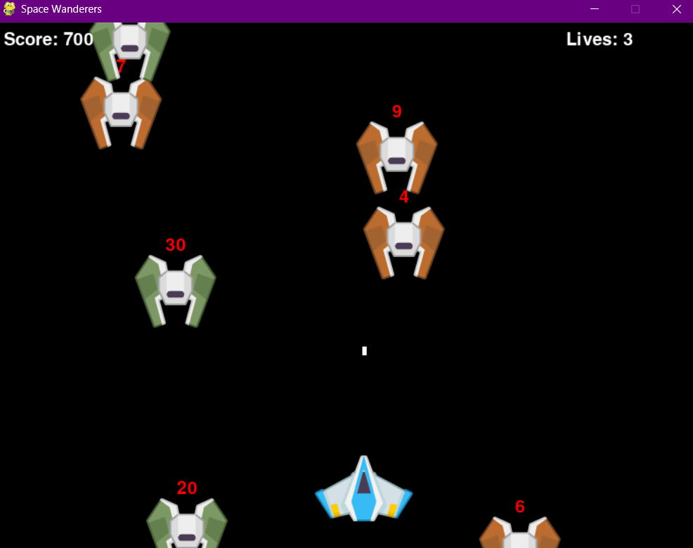

# 🌌 SPACE WANDERERS



*Space Wanderers, iki cesur arkadaş olan **Melisa* ve *Batuhan*’ın galaksiler arası destansı mücadelesini konu alan, retro hissiyatlı 2D bir uzay savaş oyunudur. Oyuncular, düşman gemilerine karşı hayatta kalmaya çalışırken reflekslerini, stratejilerini ve hedef kabiliyetlerini test eder.



---

## 📚 İçindekiler

- [🎮 Özellikler](#-özellikler)
- [⚙️ Kurulum](#️-kurulum)
- [🚀 Oynanış](#-oynanış)
- [🖼️ Görseller](#-görseller)
- [💻 Geliştirici Notları](#-geliştirici-notları)
- [🤝 Katkıda Bulunma](#-katkıda-bulunma)
- [📄 Lisans](#-lisans)
- [🙏 Teşekkürler](#-teşekkürler)

---

## 🎮 Özellikler

- Python + Pygame ile geliştirilmiş.
- Sprite animasyon desteği (patlama efektleri).
- Oyuncu mermi ateşleyebilir, düşmanlara çarpınca canı azalır.
- Her düşman yok edildiğinde 100 puan kazanılır.
- Oyun sonunda yeniden başlatma desteği.
- Basit kontroller: ← ↑ → ↓ hareket, SPACE ateş, R restart.
- Yeşil düşman patlatılınca merminin gücü iki katına çıkar.

---

## ⚙️ Kurulum

```bash
git clone https://github.com/Batuhan-Guzel/oyun
cd oyun
pip install pygame
python main.py

### Gereksinimler

- Python
- pygame kütüphanesi

## Oynanış
Oyunu başlat: python main.py

Oyuncu hareket ettir: Yön tuşları (←, →)

Mermi ateşle: SPACE

Yetenek Kullan: X

Yeniden başlat: R


## Geliştirici Notları
Bu oyun, Pygame kullanılarak temel sprite kontrolü, çarpışma algılama, skor takibi ve tuş etkileşimi gibi oyun geliştirmenin temel yapı taşlarını göstermek amacıyla geliştirilmiştir. Kod modülerdir:

player.py, enemy.py, bullet.py sınıf bazlı ayrılmıştır.

Tüm nesneler pygame.sprite.Group() kullanılarak yönetilir.

game.py içinde oyun döngüsü, skor takibi, yaşam kontrolü ve olay yönetimi yer alır.